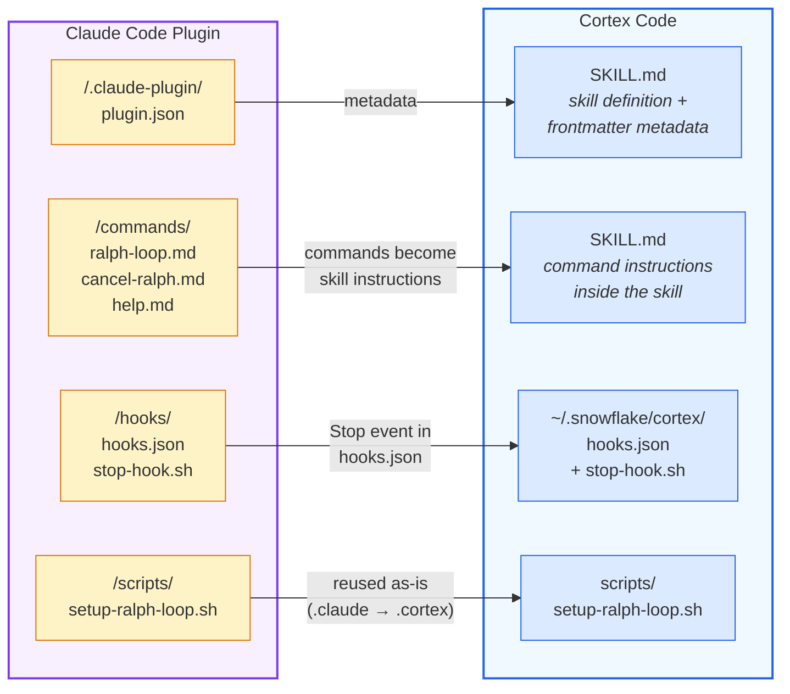
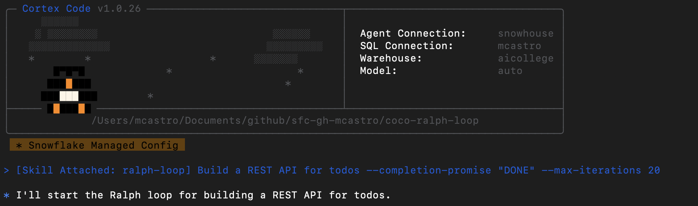
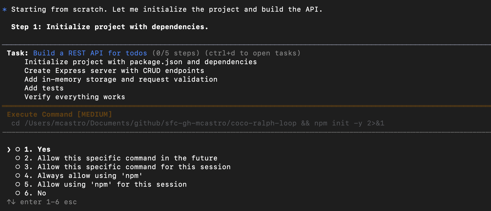
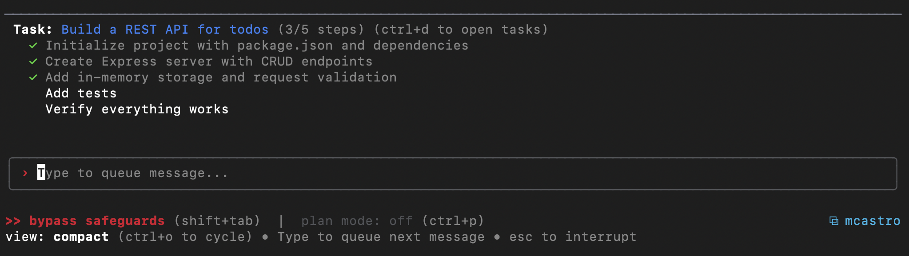
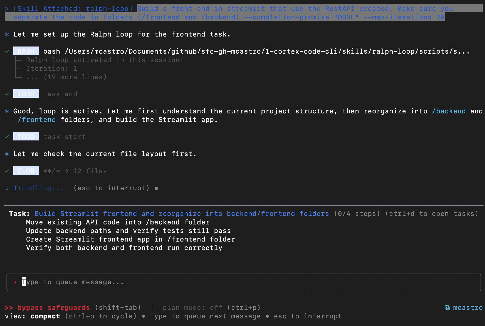
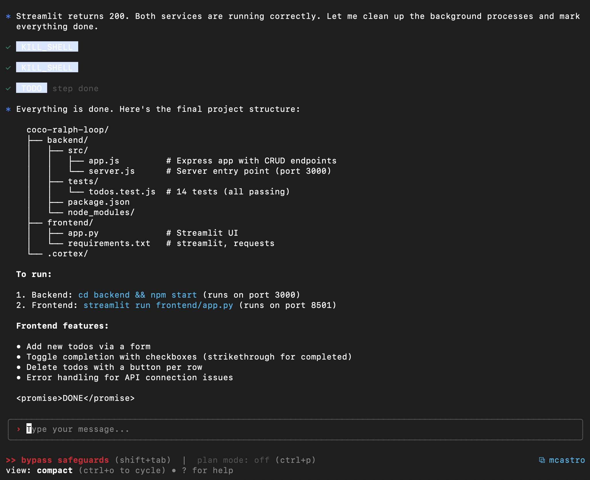
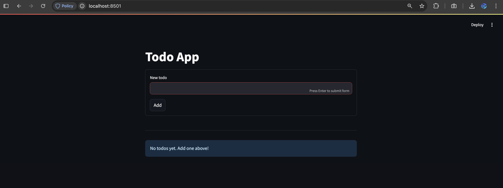
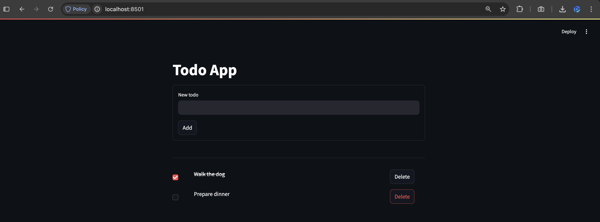

# Cortex Code: Ralph-in-the-loop 

This repo contains the information needed to add "Ralph-in-the-loop" in Snowflake Cortex Code (CoCo).

The first section decribe how to add it to CoCo.

The second section shows the result of using "Ralph-in-the-loop" in CoCo in order to create a simple REST API for todos with Streamlit front-end.

# How to add Ralph-in-the-loop in Cortex Code

Ralph-in-the-loop is a self-referential feedback loop technique where the same prompt is fed back to the agent repeatedly. Each iteration, the agent sees its previous work in files and git history, allowing incremental improvement until the task is done. This was originally created as a [Claude Code plugin](https://github.com/anthropics/claude-code/tree/main/plugins/ralph-wiggum) and the steps below show how to port it to Cortex Code using **skills** and **hooks**.

### Plugin to Skills+Hooks mapping

The diagram below shows how each Claude Code plugin component maps to its Cortex Code equivalent:



| Claude Code | Cortex Code | What changed |
|---|---|---|
| `plugin.json` | `SKILL.md` frontmatter | Metadata (name, description) moves to YAML frontmatter |
| `/commands/*.md` | Instructions inside `SKILL.md` | Slash commands become skill instructions invoked via `$ralph-loop` |
| `/hooks/hooks.json` | `~/.snowflake/cortex/hooks.json` | Hook registration moves to global config |
| `/hooks/stop-hook.sh` | `hooks/stop-hook.sh` | Output format adapted (`continue: false` + `stopReason`) |
| `/scripts/setup-ralph-loop.sh` | `scripts/setup-ralph-loop.sh` | `.claude/` paths changed to `.cortex/` |


There two options to port it: option 1

## Option 1: Ask Cortex Code to do it for you.

You can point to the Claude Code implementation of "Ralph-in-the-loop" from Cortex Code and ask it to port it.

Here is the instruction I gave to CoCo.

> Can you help me to port the ralph wiggum plugin from https://github.com/anthropics/claude-code/tree/main/plugins/ralph-wiggum/n 2: Use Cortex Code's hooks system
>
> You can check CoCo plan and steps to implement this [here](./docs/create-ralph-loop/cortex-session-f82e4645-4371-4cba-9012-54f818a3dc23/index.html).


## Option 2: Do it yourself.

If you like to do it yourself, you can follow the steps below. In summary the modifications needed are:

1. **Create the skill directory** -- project-level or global
2. **Create SKILL.md** -- the skill definition
3. **Create the setup script** -- initializes the loop state file
4. **Create the stop hook** -- the core loop logic that blocks exit and re-feeds the prompt
5. **Register the stop hook** -- add to ~/.snowflake/cortex/hooks.json
6. **Restart Cortex Code** -- hooks are snapshotted at session star

You need the following in order to continue.

- [Cortex Code CLI](https://docs.snowflake.com/en/user-guide/cortex-code/cortex-code) installed
- `jq` installed (`brew install jq` on macOS)

### Step 1: Create the skill directory

Create a `ralph-loop` skill with subdirectories for scripts and hooks. You can place it in your project's skills folder or in the global skills folder.

```bash
# Option A: Project-level (only available in this repo)
mkdir -p .cortex/skills/ralph-loop/scripts
mkdir -p .cortex/skills/ralph-loop/hooks

# Option B: Global (available in all projects)
mkdir -p ~/.snowflake/cortex/skills/ralph-loop/scripts
mkdir -p ~/.snowflake/cortex/skills/ralph-loop/hooks
```

### Step 2: Create the skill file (SKILL.md)

Create `SKILL.md` inside the `ralph-loop/` directory. This defines the skill that Cortex Code loads when you type `$ralph-loop`. Replace `<SKILL_DIR>` with the absolute path to the `ralph-loop` directory you created in Step 1.

```markdown
---
name: ralph-loop
description: "Ralph Wiggum iterative development loop. Use when: user wants to run a continuous iteration loop, ralph loop, ralph wiggum. Triggers: ralph-loop, ralph, cancel-ralph, iterative loop."
tools: ["bash"]
---

# Ralph Wiggum Loop

Implementation of the Ralph Wiggum technique for iterative, self-referential AI development loops.

## Commands

### Starting a loop

When the user says `$ralph-loop`, run the setup script:

\```bash
bash <SKILL_DIR>/scripts/setup-ralph-loop.sh <PROMPT> [OPTIONS]
\```

**Options:**
- `--max-iterations <n>` - Max iterations before auto-stop (default: unlimited)
- `--completion-promise <text>` - Phrase that signals completion

After running the script, immediately begin working on the task described in the prompt.

### Cancelling a loop

When the user says `$cancel-ralph`:

1. Check if `.cortex/ralph-loop.local.md` exists
2. If not found: Say "No active Ralph loop found."
3. If found: read the iteration number, remove the file, report cancellation

## Completion Promise Rules

CRITICAL: If a completion promise is set, you may ONLY output the promise tag when the statement is completely and unequivocally TRUE.

- Use `<promise>YOUR_PHRASE</promise>` XML tags exactly
- Do NOT output false promises to escape the loop
```

### Step 3: Create the setup script

Create `scripts/setup-ralph-loop.sh` inside the `ralph-loop/` directory. This script initializes the loop state file when `$ralph-loop` is invoked.

```bash
#!/bin/bash
set -euo pipefail

PROMPT_PARTS=()
MAX_ITERATIONS=0
COMPLETION_PROMISE="null"

while [[ $# -gt 0 ]]; do
  case $1 in
    --max-iterations)
      MAX_ITERATIONS="$2"; shift 2 ;;
    --completion-promise)
      COMPLETION_PROMISE="$2"; shift 2 ;;
    *)
      PROMPT_PARTS+=("$1"); shift ;;
  esac
done

PROMPT="${PROMPT_PARTS[*]}"
if [[ -z "$PROMPT" ]]; then
  echo "Error: No prompt provided" >&2; exit 1
fi

mkdir -p .cortex

if [[ -n "$COMPLETION_PROMISE" ]] && [[ "$COMPLETION_PROMISE" != "null" ]]; then
  COMPLETION_PROMISE_YAML="\"$COMPLETION_PROMISE\""
else
  COMPLETION_PROMISE_YAML="null"
fi

cat > .cortex/ralph-loop.local.md <<EOF
---
active: true
iteration: 1
max_iterations: $MAX_ITERATIONS
completion_promise: $COMPLETION_PROMISE_YAML
started_at: "$(date -u +%Y-%m-%dT%H:%M:%SZ)"
---

$PROMPT
EOF

echo "Ralph loop activated! Iteration: 1"
echo "Max iterations: $(if [[ $MAX_ITERATIONS -gt 0 ]]; then echo $MAX_ITERATIONS; else echo unlimited; fi)"
if [[ "$COMPLETION_PROMISE" != "null" ]]; then
  echo "Completion promise: $COMPLETION_PROMISE"
  echo "To complete, output: <promise>$COMPLETION_PROMISE</promise>"
fi
echo ""
echo "$PROMPT"
```

### Step 4: Create the stop hook

Create `hooks/stop-hook.sh` inside the `ralph-loop/` directory. This is the core of the loop -- it intercepts session exit, increments the iteration counter, and feeds the same prompt back.

```bash
#!/bin/bash
set -euo pipefail

HOOK_INPUT=$(cat)
RALPH_STATE_FILE=".cortex/ralph-loop.local.md"

# No active loop - allow exit
if [[ ! -f "$RALPH_STATE_FILE" ]]; then
  exit 0
fi

# Parse state from frontmatter
FRONTMATTER=$(sed -n '/^---$/,/^---$/{ /^---$/d; p; }' "$RALPH_STATE_FILE")
ITERATION=$(echo "$FRONTMATTER" | grep '^iteration:' | sed 's/iteration: *//')
MAX_ITERATIONS=$(echo "$FRONTMATTER" | grep '^max_iterations:' | sed 's/max_iterations: *//')
COMPLETION_PROMISE=$(echo "$FRONTMATTER" | grep '^completion_promise:' | sed 's/completion_promise: *//' | sed 's/^"\(.*\)"$/\1/')

# Validate state
if [[ ! "$ITERATION" =~ ^[0-9]+$ ]] || [[ ! "$MAX_ITERATIONS" =~ ^[0-9]+$ ]]; then
  echo "Ralph loop: State file corrupted, stopping." >&2
  rm "$RALPH_STATE_FILE"; exit 0
fi

# Check max iterations
if [[ $MAX_ITERATIONS -gt 0 ]] && [[ $ITERATION -ge $MAX_ITERATIONS ]]; then
  echo "Ralph loop: Max iterations ($MAX_ITERATIONS) reached."
  rm "$RALPH_STATE_FILE"; exit 0
fi

# Check for completion promise in transcript
TRANSCRIPT_PATH=$(echo "$HOOK_INPUT" | jq -r '.transcript_path // empty' 2>/dev/null || echo "")
if [[ -n "$TRANSCRIPT_PATH" ]] && [[ -f "$TRANSCRIPT_PATH" ]]; then
  if grep -q '"role":"assistant"' "$TRANSCRIPT_PATH" 2>/dev/null; then
    LAST_OUTPUT=$(grep '"role":"assistant"' "$TRANSCRIPT_PATH" | tail -1 | \
      jq -r '.message.content | map(select(.type == "text")) | map(.text) | join("\n")' 2>/dev/null || echo "")
    if [[ "$COMPLETION_PROMISE" != "null" ]] && [[ -n "$COMPLETION_PROMISE" ]] && [[ -n "$LAST_OUTPUT" ]]; then
      PROMISE_TEXT=$(echo "$LAST_OUTPUT" | \
        perl -0777 -pe 's/.*?<promise>(.*?)<\/promise>.*/$1/s; s/^\s+|\s+$//g; s/\s+/ /g' 2>/dev/null || echo "")
      if [[ -n "$PROMISE_TEXT" ]] && [[ "$PROMISE_TEXT" = "$COMPLETION_PROMISE" ]]; then
        echo "Ralph loop complete: <promise>$COMPLETION_PROMISE</promise>"
        rm "$RALPH_STATE_FILE"; exit 0
      fi
    fi
  fi
fi

# Continue loop: increment iteration and feed same prompt back
NEXT_ITERATION=$((ITERATION + 1))
PROMPT_TEXT=$(awk '/^---$/{i++; next} i>=2' "$RALPH_STATE_FILE")

TEMP_FILE="${RALPH_STATE_FILE}.tmp.$$"
sed "s/^iteration: .*/iteration: $NEXT_ITERATION/" "$RALPH_STATE_FILE" > "$TEMP_FILE"
mv "$TEMP_FILE" "$RALPH_STATE_FILE"

if [[ "$COMPLETION_PROMISE" != "null" ]] && [[ -n "$COMPLETION_PROMISE" ]]; then
  SYSTEM_MSG="Ralph iteration $NEXT_ITERATION | To stop: output <promise>$COMPLETION_PROMISE</promise> (ONLY when TRUE)"
else
  SYSTEM_MSG="Ralph iteration $NEXT_ITERATION | No completion promise set"
fi

jq -n --arg prompt "$PROMPT_TEXT" --arg msg "$SYSTEM_MSG" \
  '{ "continue": false, "stopReason": ("\($msg)\n\n\($prompt)") }'
```

### Step 5: Register the stop hook

Add a `Stop` event to your Cortex Code hooks config at `~/.snowflake/cortex/hooks.json`. Replace `<SKILL_DIR>` with the absolute path to your `ralph-loop` directory.

If the file doesn't exist yet, create it:

```json
{
  "hooks": {
    "Stop": [
      {
        "hooks": [
          {
            "type": "command",
            "command": "bash <SKILL_DIR>/hooks/stop-hook.sh",
            "timeout": 30
          }
        ]
      }
    ]
  }
}
```

If you already have hooks configured, add the `Stop` entry alongside your existing events:

```json
{
  "hooks": {
    "PreToolUse": [
      ...your existing hooks...
    ],
    "Stop": [
      {
        "hooks": [
          {
            "type": "command",
            "command": "bash <SKILL_DIR>/hooks/stop-hook.sh",
            "timeout": 30
          }
        ]
      }
    ]
  }
}
```

### Step 6: Restart Cortex Code

Hooks config is snapshotted at session start. **You must start a new Cortex Code session** for the Stop hook to take effect.

```bash
cortex
```

You're all set! See the next section for usage examples.

# Using Ralph-in-the-loop in Cortex Code

Now it is time to test the "Ralph-in-the-loop" in cortex code. 

Basically the Starting a loop:

  • Type $ralph-loop followed by your task and options. 

Example $ralph-loop Build a REST API for todos --completion-promise "DONE" --max-iterations 20.

  • The agent starts working on the task immediately
  • When it tries to stop, the hook intercepts and feeds the same prompt back
  • The agent sees its previous work in files and keeps iterating

Below is a step-by-step used to create a simple REST API for todos with Streamlit front-end.

#### Step 1 : Initialize the loop

```bash
$ralph-loop Build a REST API for todos --completion-promise "DONE" --max-iterations 20
```



#### Step 2: Approve task

To follow up the execution you can approve all steps, or use the "/bypass" to make sure it run autonomously.



PS: Need to add /bypass. Things are much better now.



#### Step 3: Now lets create the frontend.

```bash
$ralph-loop  Build a front end in streamlit that use the RestAPI created. Make sure you 
  separate the code in folders (/frontend and /backend) --completion-promise "DONE" --max-iterations 20
```





#### Voala - the result





Here is thef inal output from Cortex Code.

```bash
* Everything is done. Here's the final project structure:

    coco-ralph-loop/
    ├── backend/
    │   ├── src/
    │   │   ├── app.js         # Express app with CRUD endpoints
    │   │   └── server.js      # Server entry point (port 3000)
    │   ├── tests/
    │   │   └── todos.test.js  # 14 tests (all passing)
    │   ├── package.json
    │   └── node_modules/
    ├── frontend/
    │   ├── app.py             # Streamlit UI
    │   └── requirements.txt   # streamlit, requests
    └── .cortex/

  To run:

  1. Backend: cd backend && npm start (runs on port 3000)
  2. Frontend: streamlit run frontend/app.py (runs on port 8501)

  Frontend features:

  • Add new todos via a form
  • Toggle completion with checkboxes (strikethrough for completed)
  • Delete todos with a button per row
  • Error handling for API connection issues

  <promise>DONE</promise>
```

